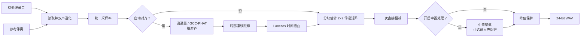

# 参考对消实现

## 问题定义

设待处理的双声道录音为 $\mathbf{y}(t)$，参考伴奏为 $\mathbf{x}(t)$，现场人声、讲话和环境声等参考中不存在的内容为
$\mathbf{v}(t)$。当前实现使用缓慢变化的实数 $2\times2$ 传递矩阵近似现场播放链路：

$$
\mathbf{y}(t) \approx \mathbf{H}(t)\mathbf{x}(t) + \mathbf{v}(t)
$$

输出残差信号为：

$$
\mathbf{r}(t)=\mathbf{y}(t)-\alpha\,\widehat{\mathbf{H}}(t)\mathbf{x}(t)
$$

其中 $\alpha\in[0,1]$ 是对消强度。该模型只估计声道间增益与串扰，不尝试用复杂频谱规则重复追逐残差；项目默认目标是保留参考无法解释的现场内容。

参考对消成立的前提是两段音频包含同一伴奏表演。不同编曲、升降调、严重动态处理或额外乐器无法仅靠时间和增益校正解决。

## 总体流程

## 时间对齐

### 粗对齐

现场相机音轨与正式音源可能波形相关性很低，但音符起音位置仍相近。因此实现优先提取多频带谱通量特征，在最多约
60 秒的公共范围内寻找显著相关峰。若特征峰不可靠，再依次尝试 GCC-PHAT 与普通互相关。

GCC-PHAT 对互功率谱只保留相位：

$$
R_{\mathrm{PHAT}}(\tau)
=\mathcal{F}^{-1}\!\left(
\frac{Y(f)\,\overline{X(f)}}
{\lvert Y(f)\,\overline{X(f)}\rvert+\varepsilon}
\right)
$$

相关峰对应粗略时延。默认先在较小范围搜索，峰落在边界附近时再扩大到最多约 20 秒，降低无意义远距离匹配的概率。

### 局部漂移

不同录音设备的时钟误差会使起点正确、结尾逐渐错位。实现把音频降采样为代理信号，每 0.1 秒估计一次局部时延，并限制相邻估计的最大变化。低相关窗口沿用预测值，最后使用三点中值滤波抑制跳变。

得到时延曲线 $d(t)$ 后，参考信号按

$$
x_{\mathrm{aligned}}(t)=x\bigl(t-d(t)\bigr)
$$

重采样。非整数位置由半径为 3 的 Lanczos 核插值，过程按块写入映射文件。

## 立体声直接对消

参考对消对每个增益窗口以加正则的最小二乘估计传递矩阵：

$$
\widehat{\mathbf H}=\mathbf Y\mathbf X^\mathsf T
\left(\mathbf X\mathbf X^\mathsf T+\lambda\mathbf I\right)^{-1}
$$

为减少人声、欢呼和瞬态峰值干扰，算法先拟合一次，依据残差能量降低异常帧权重，再执行一次加权拟合。每个输出声道的矩阵增益还会限幅，防止病态输入导致异常放大。

矩阵按 `sigma` 指定的 1、3、8 或 16 秒窗口估计，步长为窗口的三分之一；相邻三个矩阵做中值平滑，再逐采样线性插值。窗口越短越能跟踪快速音量变化，但也越可能把与伴奏相关的现场内容纳入估计。默认 8 秒偏向稳定。

整段音频以 30 秒为处理块，相邻块重叠 2 秒，并使用余弦平方与正弦平方权重交叉淡化：

$$
w_{\mathrm{old}}(\theta)=\cos^2\theta,\qquad
w_{\mathrm{new}}(\theta)=\sin^2\theta
$$

两者之和恒为 1，可降低块边界接缝。

## 可选中置处理

基础对消完成后，可显式开启“中置人声提取”。实现对左右声道执行短时傅里叶变换，根据左右功率、互谱相干性和相位差估计幻象中置占比，并主要保留约 80 Hz～14 kHz 的相干中置内容。

“弱人声保护”只在中置人声提取开启时有效。当中置置信度不足时，它回退到普通 Mid 内容，而不是恢复完整左右声道，从而尽量保护弱人声而不带回整层宽声场伴奏。

这两个选项都会改变空间感，不属于默认直接对消。是否启用应通过同一素材的试听对比决定。

## 输出保护与验证

处理结束后会把非有限值替换为有限数，并在需要时避免峰值越界。参考对消输出 24-bit PCM WAV。

算法测试覆盖时间偏移、局部漂移、矩阵串扰、块接缝、中心聚焦和弱人声保护。合成信号指标只用于发现实现回归；真实素材仍需至少比较原音、默认参数和目标参数三个版本，重点听人声大小、齿音、呼吸、和声、混响尾音与观众声是否自然。
